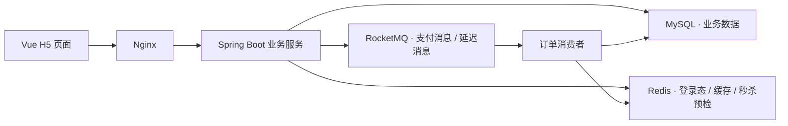

# LocalJoy · 乐享周边

> 发现周边好店，分享玩乐体验。

## 项目介绍

乐享周边是一款面向本地生活场景的周边玩乐分享应用，围绕用户验证码登录、周边店铺查询、发表分享帖、点赞、关注和秒杀店家福利券等业务展开，连接用户的探店体验、内容互动与优惠消费。

项目采用前后端分离架构，以 Spring Boot 提供业务服务，MySQL 保存业务数据，Redis 承担登录态管理、热点缓存、社交关系查询和秒杀资格预检，RocketMQ 负责订单消息处理与延迟关单。

## 技术栈

| 技术 | 用途 |
| --- | --- |
| Spring Boot / Spring MVC | 业务接口、依赖管理、请求拦截 |
| MySQL | 用户、店铺、分享帖、关注关系与订单数据存储 |
| MyBatis / MyBatis-Plus | 数据访问、分页查询与条件更新 |
| Redis | 验证码、登录态、店铺缓存、共同关注、库存预检与分布式锁 |
| Lua | 秒杀资格检查与 Redis 原子操作 |
| RocketMQ | 支付结果异步处理、订单延迟检查 |
| Vue 2 / Element UI / Axios | H5 页面与前后端交互 |
| Nginx | 静态资源服务与 API 反向代理 |
| Maven / JMeter | 项目构建与压力测试 |

## 业务功能

### 用户登录

使用手机号和验证码完成登录，通过令牌识别用户身份，支持登录态续期、访问校验和退出登录。

### 周边店铺

按分类浏览店铺，通过名称搜索和详情查询了解店铺信息，并查看店家提供的福利券。

### 玩乐分享

通过图片上传和分享帖发布记录探店体验，结合热门内容、个人分享列表和点赞互动组织内容展示。

### 用户关注

支持关注、取消关注、关注状态查询与共同关注，建立用户之间的社交关系。

### 福利券与订单

围绕店家福利券组织秒杀资格校验、库存扣减、订单创建、支付结果处理和超时关单流程。

## 核心技术

### 1. Redis 登录态与 ThreadLocal 用户上下文

验证码使用 Redis String 存储，用户登录信息使用 Redis Hash 存储，并设置过期时间控制数据生命周期。

请求进入后，拦截器根据 `authorization` 请求头读取用户信息并刷新登录态，将用户信息写入 ThreadLocal，供同一请求线程中的业务逻辑获取。登录拦截器负责受保护接口的身份校验，请求结束时清理线程上下文。

### 2. 店铺缓存与缓存穿透处理

店铺查询采用缓存优先策略：先查询 Redis，未命中时回源 MySQL，再将查询结果写入缓存。

对于数据库中不存在的店铺，写入具有较短过期时间的空值缓存，减少重复无效请求对数据库的访问，降低缓存穿透带来的查询压力。

### 3. 延时双删与缓存一致性

更新店铺信息后删除缓存，并在延迟 500ms 后再次执行删除，缩短并发读写下旧数据重新写入缓存造成的不一致窗口。

通过数据库更新与两次缓存失效配合，降低 Redis 与 MySQL 双写过程中的数据不一致风险。

### 4. Redis + Lua 秒杀预检与库存控制

将库存校验、重复购买判断与库存预占放入 Lua 脚本，在 Redis 中原子执行，提前过滤不满足秒杀条件的请求。

数据库侧采用基于库存条件更新的乐观并发控制，通过 `stock > 0` 条件扣减库存，避免并发请求将数据库库存扣为负数。

### 5. Redis Set 共同关注

使用 Redis Set 保存用户关注的用户 ID，通过集合交集计算共同关注，再查询对应的用户信息，减少关系查询中的重复数据库访问。

### 6. RocketMQ 支付结果异步处理

通过 RocketMQ 将支付结果通知与订单状态更新解耦。支付接口写入支付标记并投递消息，由消费者异步处理订单支付结果，完成订单状态更新。

### 7. 延迟消息与超时订单处理

订单创建后投递延迟消息，在消费时检查订单状态，对超时未支付订单执行关闭和库存回补。存在支付标记时重新安排延迟检查，协调支付处理与超时关单流程。

消费端结合 Redis 锁、订单状态检查和锁归属校验，控制同一订单的并发处理，降低重复消费与状态竞争的风险。

## 系统架构



订单消费者与 HTTP 接口位于同一后端工程中，通过消息队列分离请求处理与订单后续处理。

## 项目结构

```text
localjoy/
├── src/main/java/com/lexiang/
│   ├── config/             应用配置与异常处理
│   ├── controller/         业务接口
│   ├── interceptor/        登录校验与用户上下文
│   ├── service/            核心业务逻辑
│   ├── mapper/             数据访问
│   ├── entity/             数据实体
│   ├── dto/                请求与响应对象
│   ├── mq/                 消息生产与消费
│   └── utils/              工具类与常量
├── src/main/resources/
│   ├── db/lexiang.sql      数据库表结构与演示数据
│   ├── mapper/             MyBatis 映射文件
│   ├── application*.yaml   应用配置
│   └── *.lua               秒杀与锁释放脚本
├── src/test/               测试代码
├── frontend/               H5 页面、静态资源与 Windows Nginx
├── scripts/                启停、压测与数据核对脚本
├── jmeter/                 压力测试计划
├── docker/                 RocketMQ 配置
├── docs/                   技术文档
├── .env.example            环境变量模板
└── docker-compose.yml      RocketMQ 环境编排
```

## 本地运行

### 环境准备

- JDK 17、Maven 3.9
- MySQL 8、Redis
- Windows；前端随仓库提供 Nginx
- Docker：用于启动 RocketMQ 环境

### 克隆与配置

```powershell
git clone https://github.com/still0123/localjoy.git
cd localjoy
Copy-Item .env.example .env
```

编辑 `.env`，填写本机 MySQL 与 Redis 连接参数。Redis 无密码时，将 `REDIS_PASSWORD` 留空。该配置文件已加入 Git 忽略规则。

### 初始化数据库

在 MySQL 中创建数据库，并导入初始化文件：

```sql
CREATE DATABASE lexiang CHARACTER SET utf8mb4 COLLATE utf8mb4_general_ci;
USE lexiang;
SOURCE C:/your/path/localjoy/src/main/resources/db/lexiang.sql;
```

将 `SOURCE` 路径替换为实际文件位置，也可通过数据库工具导入。脚本包含重建表语句，请使用新建的演示数据库。

### 启动项目

启动本机 MySQL（3306）和 Redis（6379），在项目根目录执行：

```powershell
powershell -NoProfile -ExecutionPolicy Bypass -File .\scripts\start-local.ps1
```

或双击 **启动乐享周边.cmd**，随后访问 **http://127.0.0.1:8080/**。

首次启动会构建后端并启动 Java 与 Nginx。修改源码后，可先停止服务，再使用 `-Rebuild` 参数重新构建。启动脚本会在 Redis 不可用时尝试启动 `.env` 指定的现有 Redis 容器。

本地演示的登录验证码通过后端日志查看：

```powershell
Get-Content .\runtime\backend.log -Encoding UTF8 -Tail 50 -Wait
```

停止项目：

```powershell
powershell -NoProfile -ExecutionPolicy Bypass -File .\scripts\stop-local.ps1
```

### 启用订单消息处理

停止应用后，启动 RocketMQ，等待 NameServer 与 Broker 就绪，再使用 `rocketmq` 配置启动：

```powershell
docker compose up -d
$env:SPRING_PROFILES_ACTIVE = 'rocketmq'
powershell -NoProfile -ExecutionPolicy Bypass -File .\scripts\start-local.ps1
```

RocketMQ Dashboard：http://127.0.0.1:8088/ 。Compose 提供消息队列环境，MySQL 与 Redis 独立启动。

### 构建

```powershell
mvn -B verify
```

## 项目文档

- [技术实现说明](docs/architecture.md)
- [构建与测试指南](docs/testing.md)

维护者：[still0123](https://github.com/still0123)
